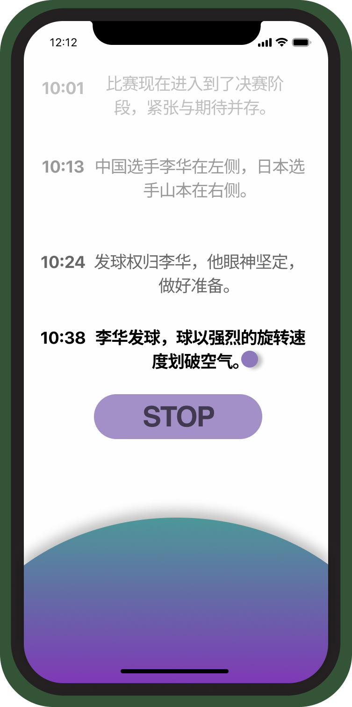

# TranscriSense

A multimodal-designed swift app for the hearing-impaired users to immerse in watching sports game. 

### Installation

`git clone` and open it in `Xcode`, click the `build and play`button

### Features

- Voice Input Recording
- Speech Recognition
- Color Changing Atmosphere Bubble
- Game and atmosphere Data Visualization
- Smart Vibration Module

### Library

- SwiftUI
- Speech
- AVFoundation
- Charts
- CoreHaptics
- Foundation

